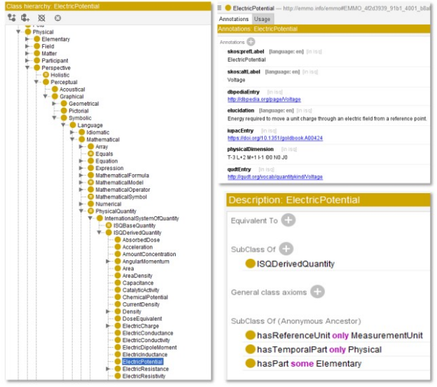
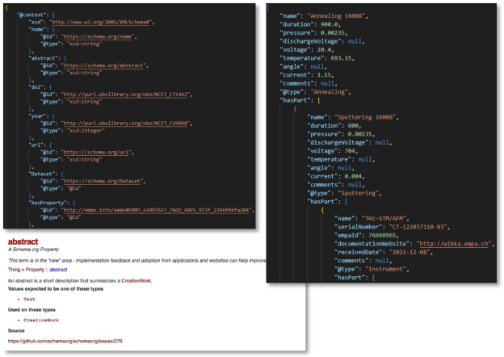

# Journey to ontologize metadata

### Authors

- Nukorn Plainpan (Empa)
- Fabio Andre DaCostaLopes (Empa)
- Edan Bainglass (PSI)
- Caterina Barillari (ETH Zurich)
- Corsin Battaglia (Empa)
- Carlo Pignedoli (Empa)
- Giovanni Pizzi (PSI)

## What is an ontology?

The term "ontology" carries diverse connotations within various fields. The most notable distinction arises between its classical philosophical usage and its contemporary computational application in knowledge engineering. The latter emerged with the definition of computational ontologies as "explicit specifications of conceptualizations".

In computer science, an ontology is defined as a formally specified, shared understanding of the key elements in a specific domain [1-4]. This concept gained prominence through a U.S. Defense Advanced Research Projects Agency (DARPA) study on knowledge sharing among computer systems in the early 1990s [5]. The study highlighted the need for standard ontologies in artificial intelligence (AI) to facilitate the sharing and reuse of knowledge between software systems.

Ontology is a formal representation of knowledge within a domain, including entities and relations between those within that domain. It essentially organizes information, promoting communication and reasoning within a particular field [5]. Ontologies are often expressed using formal languages such as Web Ontology Language (OWL) or Resource Description Framework (RDF), which allow for precise specification of the concepts and relations described in those. They are used in various diverse fields such as artificial intelligence, bioinformatics, chemistry, and biological and biomedical research [4].

## Ontologizing metadata: why the hassle?

In scientific research, the concept of ontologizing metadata has emerged as a pivotal strategy to enhance data interoperability across various research groups [6,7]. The essence of ontologizing metadata lies in structuring the data in such a manner that it becomes both machine-readable and actionable. This process not only accelerates data sharing and integration for applications such as machine learning, but also significantly boosts automation and workflow efficiency. Furthermore, ontologizing metadata upholds the principles of FAIR [8] data, making them **F**indable, **A**ccessible, **I**nteroperable, and **R**eusable, specifically focusing on the aspect of Interoperability. One of the most compelling use cases for ontologized metadata is its compatibility with SPARQL [9] queries, which allows for sophisticated data retrieval and analysis. SPARQL, a powerful query language for RDF data, allows for precise searches across structured, semantic data formats. This enables researchers to perform complex queries over diverse datasets, improving data interoperability and fostering advanced analysis. Such capability is crucial for identifying specific data points, patterns, and relationships across vast and interdisciplinary datasets, thereby accelerating discovery and innovation in scientific research. An example of how to use SPARQL with ontologies, is provided within the BattINFO [10–12] ontology for the case of "Zinc powder from a supplier" [13]. The example touches on several concepts: utilizing ontology terms and JSON-LD for resource description, transforming JSON-LD into triples by machines, understanding the roles of subject, predicate, and object in identifiers, executing basic SPARQL queries, leveraging ontology for enhanced data retrieval from various sources.

One of the key advantages of ontologies is the ability to support interoperability and integration across different systems and datasets. They enable different systems to exchange data and perform reasoning tasks, even if they were developed independently. Specifically, the exchange of research data may be facilitated via machine-actionable, self-ontologized containers of research data accompanied by ontologized metadata. A receiving platform can in turn unpack the container by following its specification and metadata. Examples of container specification formats include [RO-Crate](https://www.researchobject.org/ro-crate/) , [BagIt](https://datatracker.ietf.org/doc/html/rfc8493) , [DataCite](https://datacite.org/), [Dataverse](https://dataverse.org/), and more. These formats provide guidelines and standards for packaging research data in a FAIR way to facilitate exchange and interoperability. The PREMISE project is actively exploring these and other formats, as it continues to develop a set of guidelines for interoperability of FAIR research data in materials science. The RO-Crate specification, built on the JSON-LD serialization of RDF, has been chosen as a working example for the second MADICES workshop aimed at exploring inter-platform [interoperability](https://www.cecam.org/workshop-details/machine-actionable-data-interoperability-for-the-chemical-sciences-madices-2-1321).

Despite its numerous benefits, the task of ontologizing metadata can appear daunting at first glance. The complexity and meticulousness required may overwhelm newcomers to the process. However, this article aims to demystify the process, providing a structured guide to achieving ontologized metadata, with a specific focus on coin cell battery production and Scanning Probe Microscopy (SPM). Through this demonstration, we aim to simplify the concept and encourage more researchers to adopt this beneficial practice.

## Steps towards ontologizing metadata

Incorporating ontologies into metadata involves a series of meticulous steps. Drawing from our practices in the [PREMISE](https://ord-premise.org/) project, we outline below the essential steps of this process.

### 1. Which ontology concepts to include?

Before we could proceed with assigning ontologies to metadata, we had to identify the metadata to use to describe experiments (both experimental and computational), materials and instruments or simulations. This includes also determining the relevant units of measurement, where applicable. It is advisable to use a rather extensive range of metadata items, which will allow for flexibility in experimental adjustments down the line.

In the battery illustrative case, we selected 90 distinct metadata items for the process of coin cell battery production. This is an initial set, meant to be updated over time, created from brainstorming and feedback from the researchers active in this field with whom we are collaborating within PREMISE. In practice, each group that decided to adopt ontologies has to define their own requirements. The first step is of course identifying which metadata set could be already available from the literature in a specific research field. For the case of Scanning Probe Microscopy (SPM), we identified a metadata file available online named Nexus [14]. However, the main feedback we received from the researchers collaborating with us, is that this scheme misses several fields. Therefore, we created our own set of metadata following the information obtained from our onsite experts and from the Nanonis software [15]. We identified more than 300 distinct metadata items by combining metadata as specified in the Nanonis file format together with metadata needed to describe experimental setups, experimental procedures, inventories for molecular precursors and crystals together with all processes needed to reproduce a typical experimental project containing simulations results and microscopy results.

To maintain simplicity and clarity, we opted to organize both metadata sets (battery and SPM) in a tabulated format. This approach not only aids in visualization, but also in the subsequent steps of defining the ontology. Examples of the tabulated metadata items are provided as Excel files in the repositories of deliverables [D2.1](https://github.com/ord-premise/metadata-spectroscopy) and [D3.1](https://github.com/ord-premise/metadata-batteries).

### 2. Choosing ontology concepts

Once the metadata items have been defined, the next step is to ontologize them. We advocate for leveraging pre-existing ontology concepts wherever possible, as creating new ontologies can be both time-consuming and daunting. The advantages of using established ontologies are manifold, including compatibility with existing systems and the support of dedicated teams for ontology maintenance and consultation. In scenarios where an established ontology does not exist, one has to either collect terms from different ontologies that mostly fit the defined metadata or one can try to create an ontology from scratch. However, the latter process is extremely time-consuming and requires involvement and communication with multiple experts from the field. Because this was not a goal of the PREMISE project, we searched for terms available in existing ontologies and assigned them to our metadata. In cases where we did not find an ontology entity suited for our metadata items, we either asked the ontology developers to add it, if possible, or we left the items without any ontology link.

For our demonstration, in the case of the Battery metadata, we selected the BattInfo [10–12] ontology, developed as part of the [Battery 2030](https://battery2030.eu/) project. This ontology encompasses concepts relevant to electrocatalysis and battery chemistry and is supported by a dedicated maintenance team. Its adoption within the Battery 2030 consortium exemplifies its potential for facilitating data sharing among research partners.

In the case of the Scanning Probe Microscopy (SPM), to the best of our knowledge, no ontologies are available. We thus linked the metadata to entities from different ontologies, such as National Cancer Institute Thesaurus (NCIT) [16], Schema.org [17], Occupation Ontology (OccO) [18], Process Chemistry Ontology (PROCO) [19], Chemical Methods Ontology (CHMO) [20], Ontology for Biomedical Investigations (OBI) [21], Information Artifact Ontology (IAO) [22], Ontology of Precision Medicine and Investigation (OPMI) [23], Semanticscience Integrated Ontology (SIO) [24], Chemical Information Ontology (CHEMINF) [25], and CHemical Entities of Biological Interest (ChEBI) [26]. These entities were found using the Ontology Lookup Service (OLS) [27], which is a search engine for finding ontologies available online. We also used Elementary Multiperspective Material Ontology (EMMO) [28]. As EMMO is not present in the OLS search engine, we used the Protégé software [29] for accessing it. Protégé allows to explore the different concepts and relations that are explained in an ontology. In Protégé, one must upload the desired ontology file (Turtle, RDF/XML, OWL/XML, etc.) [30]. Then, using the interface, it is possible to verify all the concepts and the different relations contained in the ontology (see Figure 1 for an example). To ontologise data, one must search for the concepts that one wants to describe and, if available, copy the concepts' IRIs (Internationalized Resource Identifiers) into the metadata schema.

_Figure 1. The scheme on the left panel shows an example of the class hierarchy of an entity. The example refers to the entity "ElectricPotential". The panel on the right shows that from the class hierarchy we can directly access the entity definition "ElectricPotential" and the international resource identifier (IRI) together (top) with the relations between the entity "ElectricPotential" and other entities (for example "ReferenceUnit"). In this example, "ElectricalPotential" can only have "MeasurementUnit" as a "ReferenceUnit", can only have subclasses "Physical" in the "TemporalPart" and can contain different "Elementary" (another class)._

### 3. Ontologizing each metadata term

With an ontology concept in hand, the subsequent step involves adding the ontology to each metadata item. This phase is critical for generating a coherent and usable ontologized metadata file. The specific syntax used to write the ontologized metadata file, called dialect, can be diverse, as there are multiple ways to write a RDF file (such as JSON-LD) containing the ontologized metadata. A specific structure for such a file should be based on foreseen applications, e.g. on the way the files will be accessed for queries. For this reason, the file structure should be discussed/agreed within a consortium of users and developers to ensure consistency, especially when the metadata are queried. We provide below an example based on a JSON-LD file (see the example files provided in the Supplementary information for details). In Figure 2, we show a portion of a JSON-LD file created with data from an example of SPM experiments.

_Figure 2. Example of JSON-LD file. Top left: context of the JSON-LD file. The context contains the parameters (e.g. name) needed for defining the metadata. For example "abstract" is identified by the entity https://schema.org/abstract within the ontology schema.org . The definition of "abstract" within the ontology is obtained (bottom left panel) following the link. Abstract is a "string" as pointed out by "@type" and a "string" is defined within "xsd". The right panel is the graph of the JSON-LD, it contains metadata. For example, we have here three objects: annealing, sputtering and instrument. We see the metadata of these objects (for example "name" or "current") and the relation between these objects. Annealing contains sputtering, which contains instrument. Here "hasPart" means that for an annealing we need to do sputtering before. And to do sputtering we need to have an instrument._

### 4. Choosing the file format

Selecting the appropriate file format for the ontologized metadata is another key aspect of the process. Each format, including JSON-LD, Turtle (TTL), RDF/XML, and OWL (Web Ontology Language), has its unique strengths and weaknesses. JSON-LD [31] is a JSON-based file format that incorporates a context for representing RDF graphs. It is a lightweight format and commonly used on the web. Turtle (TTL) [32] uses simple triple statements for representing RDF making it easy for humans to read and write. RDF/XML is an RDF file format designed in XML [33]. OWL/XML [34] is a file format specifically designed for storing OWL ontologies. It can store both the structure (classes, properties, and axioms) and the instances using the defined concepts.

The choice of format should be guided by the intended applications and platforms for the ontologized data within the research group or consortium. In our use-cases, we selected the JSON-LD format for its compatibility with web applications, thereby suiting our demonstration needs. It is worth noting that conversion between different file formats can usually be accomplished with relatively little effort using, for example, simple Python scripts.

### 5. Automating the process

Manual creation of ontologized metadata can be daunting, time-consuming, and error-prone. For this reason, we highly recommend automating the process. For our datasets, we devised a Python script capable of converting tabulated data (in Excel format) to JSON-LD efficiently. These scripts are available in the repositories of deliverables [D2.1](https://github.com/ord-premise/metadata-batteries) and [D3.1](https://github.com/ord-premise/metadata-spectroscopy).

## Conclusion

The guidelines described in this paper underscore the significance and practicality of embedding ontologies within metadata, drawing on the first-year insights of the PREMISE project and extensive discussions with field experts in battery technology and scanning probe microscopy. This document aims to empower researchers with the necessary insights and instruments for this critical task. With detailed steps and illustrations, it seeks to advocate for the widespread implementation of ontologically enriched metadata in scientific endeavors. Such a practice promises to enhance collaborative efforts and drive innovation. The metadata frameworks and associated ontologies developed within our project are available on the PREMISE project's [website](https://ord-premise.org//workpackages/).

## References

1. Gruber, T. R. A translation approach to portable ontology specifications. Knowl. Acquis. 5, 199–220 (1993).
2. Gruber, T. R. Toward principles for the design of ontologies used for knowledge sharing? Int. J. Hum.-Comput. Stud. 43, 907–928 (1995).
3. Studer, R., Benjamins, V. R. & Fensel, D. Knowledge engineering: Principles and methods. Data Knowl. Eng. 25, 161–197 (1998).
4. National Academies of Sciences, Engineering, and Medicine; Division of Behavioral and Social Sciences and Education; Board on Behavioral, Cognitive, and Sensory Sciences; Committee on Accelerating Behavioral Science through Ontology Development and Use. Ontologies in the Behavioral Sciences: Accelerating Research and the Spread of Knowledge. (National Academies Press (US), Washington (DC), 2022).
5. Guarino, N., Oberle, D. & Staab, S. What Is an Ontology? in Handbook on Ontologies (eds. Staab, S. & Studer, R.) 1–17 (Springer, Berlin, Heidelberg, 2009). doi:10.1007/978-3-540-92673-3_0.
6. Ameri, F., Sormaz, D., Psarommatis, F. & Kiritsis, D. Industrial ontologies for interoperability in agile and resilient manufacturing. Int. J. Prod. Res. 60, 420–441 (2022).
7. Hagedorn, T. J., Smith, B., Krishnamurty, S. & Grosse, I. Interoperability of disparate engineering domain ontologies using basic formal ontology. J. Eng. Des. 30, 625–654 (2019).
8. Wilkinson, M. D. et al. The FAIR Guiding Principles for scientific data management and stewardship. Sci. Data 3, 160018 (2016).
9. Semantic Web Programming | Wiley. Wiley.com https://www.wiley.com/en-us/Semantic+Web+Programming-p-9781118080603.
10. BIG-MAP/BattINFO. BIG-MAP (2024).
11. BattINFO - BIG-MAP. https://www.big-map.eu https://www.big-map.eu/dissemination/battinfo.
12. Battery Interface Ontology — BattInfo documentation. https://big-map.github.io/BattINFO/.
13. Example: Zinc Powder from a Supplier — BattInfo documentation. https://emmo-repo.github.io/domain-electrochemistry/example_linked_data_zinc_powder.html.
14. Panighel, M. rescipy-project/nxstm: v0.3.0. Zenodo https://doi.org/10.5281/zenodo.5792931 (2021).
15. SPECS. Mimea Software. https://www.specs-group.com/nanonis/products/mimea/mimea-software/.
16. NCI-Thesaurus/thesaurus-obo-edition. NCI-Thesaurus (2023).
17. Schema.org - Schema.org. https://schema.org/.
18. Occupation-Ontology/OccO. An Ontology of Occupations (2024).
19. proco-ontology/PROCO. proco-ontology (2023).
20. Ontologies, R. S. C. rsc-ontologies/rsc-cmo. (2023).
21. obi-ontology/obi. obi-ontology (2024).
22. information-artifact-ontology/IAO. IAO (2024).
23. OPMI/opmi. OPMI: Ontology of Precision Medicine and Investigation (2023).
24. MaastrichtU-IDS/semanticscience. Maastricht University IDS (2024).
25. Hastings, J. et al. The Chemical Information Ontology: provenance and disambiguation for chemical data on the biological semantic web. https://doi.org/10.1371/JOURNAL.PONE.0025513 (2023).
26. ebi-chebi/ChEBI. EBI - ChEBI (2023).
27. Ontology Lookup Service (OLS). https://www.ebi.ac.uk/ols4/.
28. Elementary Multiperspective Material Ontology (EMMO). GitHub https://github.com/emmo-repo.
29. protégé. https://protege.stanford.edu/.
30. Starting Protégé — GO Ontology 0.5 documentation. https://go-protege-tutorial.readthedocs.io/en/latest/StartingProtege.html.
31. JSON-LD - JSON for Linking Data. https://json-ld.org/.
32. RDF 1.1 Turtle. https://www.w3.org/TR/turtle/.
33. RDF 1.1 XML Syntax. https://www.w3.org/TR/rdf-syntax-grammar/.
34. OWL 2 Web Ontology Language XML Serialization (Second Edition). https://www.w3.org/TR/owl2-xml-serialization/.

## Supporting information

### Battery research

[https://github.com/ord-premise/metadata-batteries](https://github.com/ord-premise/metadata-batteries)

###### battery_schemas_example_filled.xslx

An example filled tabulated metadata file, illustrating how the metadata is organized

###### jsonld_converter.py

The script for automating the conversion from tabulated metadata to JSON-LD, showcasing the practicality of this approach

###### example_jsonld.json

An example JSON-LD file, demonstrating the outcome of the conversion process

### SPM research

[https://github.com/ord-premise/metadata-spectroscopy](https://github.com/ord-premise/metadata-spectroscopy)

###### metadata_experiment_objects.xlsx

- An experiment example filled a tabulated metadata file, including the relations between the different objects and the metadata of those objects split by object type. The relations must be written on an "Experiment" datasheet and the objects that are referred to must be introduced in the datasheets according to the object type

###### metadata_schema_for_eln.xlsx

A tabulated metadata file containing 7 datasheets:

- "Metadata Schema" contains the different available objects in the SPM case and the parameters of those objects (name, description, units, who inputs it, the ontology code, the ELN code, the ELN datatype, and some additional comments)
- "Metadata Updates" contains some updates that should be done on the metadata schema
- "Ontology definition" contains the ontology code that we have given, the link to one ontology, and the datatype of the entity
- "openBIS – parameters" contains the details of all the parameters that may be created inside the ELN (openBIS in our case)
- A sheet containing the controlled vocabularies that are used inside the ELN
- A sheet containing the vocabulary terms that are used inside the ELN
- A sheet containing a Legend with colors that I use to discuss new parameters with other researchers from our group

###### converter_excel_to_jsonld.py

A Python script that automatically converts the information on the Excel files into a JSON-LD file

###### selected_object_schema.json

The JSON-LD that is returned by the Python script. This JSON-LD file can afterwards be used to populate the ELN using an API
